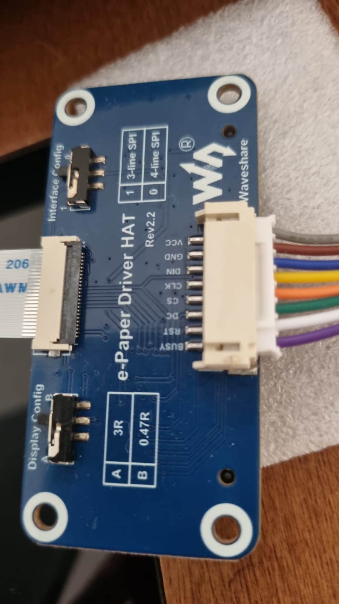

# esp32-cam-epaper POC

## PT

Apenas uma POC para validar se é possível imprimir uma foto do esp32-cam diretamente em uma tela de eink. Com o algotimo que eu usei a qualidade da imagem ficou bem ruim.

Conexões da plata com o esp32-cam:

BUSY - ROXO    - IO12  
RST  - BRANCO  - IO2  
DC   - VERDE   - IO3/UnR (pode usar o IO4 durante o desenvolvimento)  
CS   - LARANJA - IO15  
CLK  - AMARELO - IO14  
DIN  - AZUL    - IO13  
GND  - MARROM  - GND (proximo ao 3v3)  
VCC  - CINZA   - 3V3  

Importante:  
- Não utilizei o IO16 como BUSY porque a utilização deste IO corrompe a memória PSRAM
- Não utilizei o IO04 como DC porque ele intefere no uso da luz de flash (LED). Mas isso dificulta durante o desenvolvimento porque tem que ficar mexendo nas conexões para fazer o flash do código.

## EN

Just a POC to validate if it is possible to print a photo from esp32-cam directly on an eink screen.

Connections from the platform with the esp32-cam:

BUSY - PURPLE - IO12  
RST - WHITE - IO2  
DC - GREEN - IO3/UnR (can use IO4 during development)  
CS - ORANGE - IO15  
CLK - YELLOW - IO14  
DIN - BLUE - IO13  
GND - BROWN - GND (next to 3v3)  
VCC - GRAY - 3V3  

Important:
- I did not use IO16 as BUSY because using this IO corrupts PSRAM memory.
- I did not use IO04 as DC because it interferes with the use of the flash light (LED). But this makes it difficult during development because you have to keep changing the connections to flash the code.

# Imagens

# Hardware
- esp32-cam com ov2640 (clone AI-Thinker)
- Waveshare 7.5 inch e-paper display with 4 gray shades

## Referencias
- https://www.instructables.com/Multifunctional-ESP32-Cam-With-E-paper-Display-for/
- https://github.com/ZinggJM/GxEPD2_4G/blob/master/examples/GxEPD2_4G_MixedExample/GxEPD2_4G_MixedExample.ino
- https://github.com/espressif/arduino-esp32/tree/master/libraries/ESP32/examples/Camera/CameraWebServer
- https://hackaday.com/2023/02/10/an-instant-camera-using-e-paper-as-film/
- Bing Chat :)
